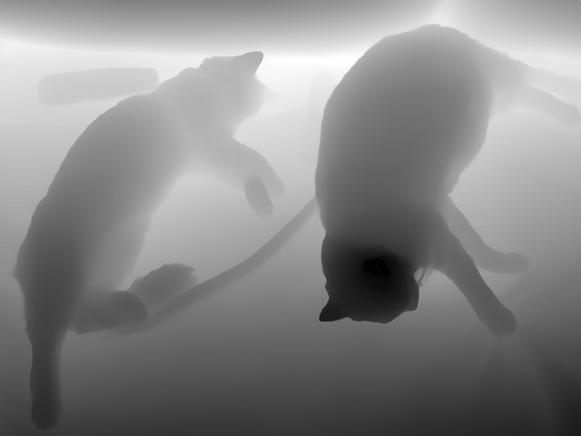
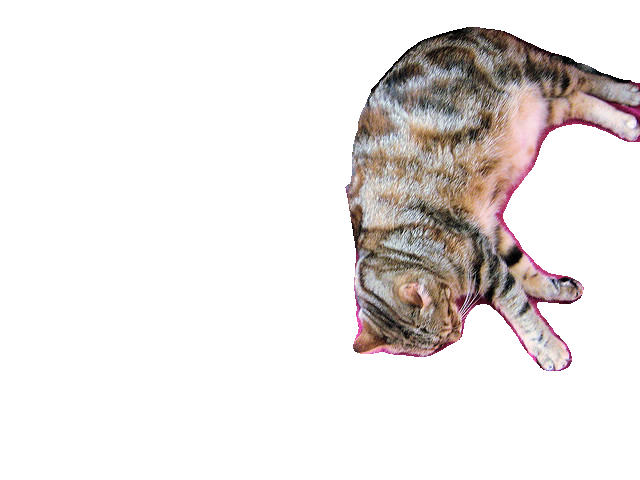
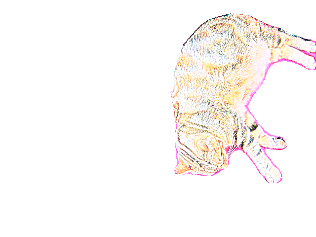
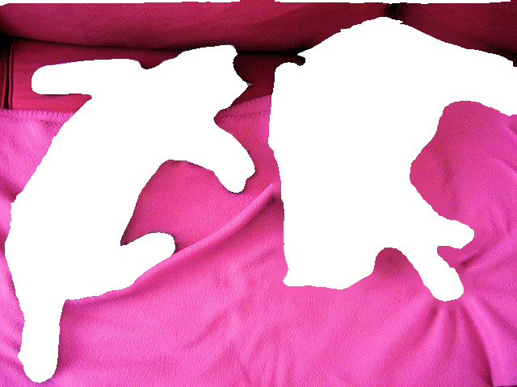
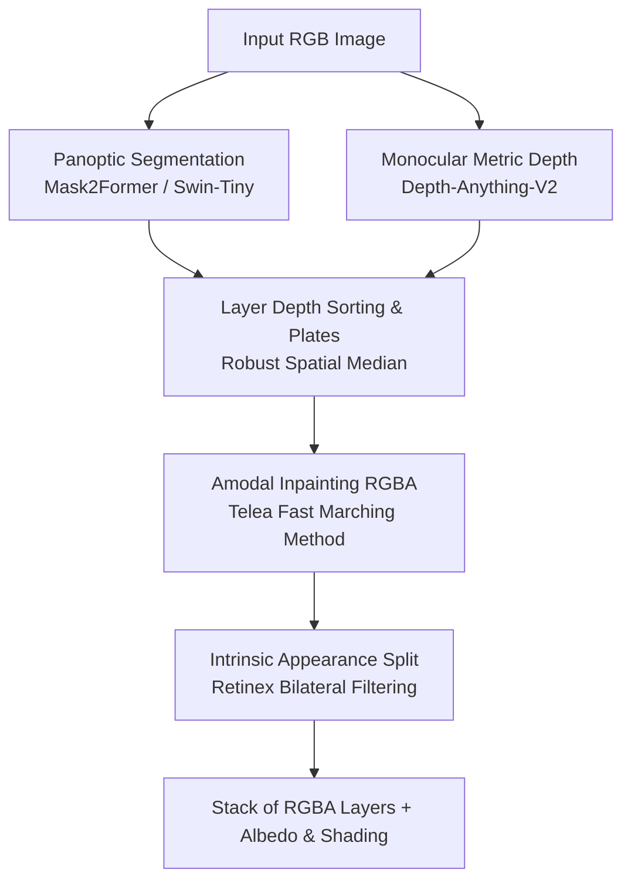

# Layered Scene Representations from a Single Image

An automated, zero-shot computer vision pipeline that decomposes a single 2D RGB image into interpretable, depth-ordered **RGBA amodal layers** alongside per-layer **intrinsic appearance components (Albedo & Shading)**.

---

## 1. Qualitative Results & Visual Pipeline

### Input Scene & Depth Reconstruction
| Original RGB Input | Monocular Relative Depth Map |
| :---: | :---: |
|  |  |

### Extracted Layer 00 (Foreground Instance) & Intrinsic Appearance Split
| RGBA Instance Layer | Albedo (Diffuse Reflectance) | Shading (Illumination & Geometry) |
| :---: | :---: | :---: |
|  |  |  |

### Amodal Background Plate (Occlusions Inpainted)
The occluding foreground objects are removed and the hidden surface geometry is reconstructed seamlessly:
<p align="center">
  
</p>

---

## 2. Technical Methodology & System Architecture


### 2.1 Monocular Relative Depth Estimation
Using **Depth-Anything-V2-Small**, continuous disparity maps are generated and normalized to $[0.0, 1.0]$:
$$D_{\text{norm}}(x, y) = 1.0 - \frac{D_{\text{raw}}(x, y) - \min(D)}{\max(D) - \min(D) + \epsilon}$$
where $0.0$ strictly represents near-camera foreground planes and $1.0$ represents far background infinity.

### 2.2 Panoptic Instance & Stuff Segmentation
Using **Mask2Former**, the input scene is segmented into $K$ disjoint binary masks $\{M_1, \dots, M_K\}$. Residual regions not classified into instances are consolidated into a persistent background plate:
$$M_{\text{bg}} = \neg \left( \bigcup_{k=1}^K M_k \right)$$

### 2.3 Robust Depth Ordering
To eliminate border outlier noise, representative layer depths are derived using spatial medians rather than means:
$$d_k = \text{median}\Big( \big\{ D_{\text{norm}}(x, y) \;\big\vert{}\; (x, y) \in M_k \big\} \Big)$$
Layers are arranged in strictly ascending order from front to back ($d_0 \le d_1 \le \dots \le d_{N-1}$).

### 2.4 Amodal Inpainting & Layer Assembly
For any background entity $k$, pixels occluded by foreground layers $j < k$ form an occlusion footprint:
$$O_k = \bigcup_{j < k} M_j$$
We apply morphological dilation to suppress edge-boundary halos and reconstruct occluded textures using Telea's Fast Marching inpainting. The resulting RGB array is merged with the layer's binary mask to form an exportable 4-channel RGBA array.

### 2.5 Intrinsic Appearance Decomposition (Stretch Goal)
Following classical Retinex theory:
$$I(x, y) = R(x, y) \cdot S(x, y)$$
Shading $S$ is extracted by applying edge-preserving bilateral filtering over the luminance channel. Diffuse albedo $R$ is isolated by:
$$R(x, y) = \text{clip}\left(\frac{I(x, y)}{S(x, y) + \epsilon}, 0, 1\right)$$

---

## 3. Installation & Usage

```bash
git clone [https://github.com/](https://github.com/)<your-username>/layered-image-representations.git
cd layered-image-representations
pip install -r requirements.txt
python run_pipeline.py --image assets/sample.png --output_dir outputs/sample_run --device c